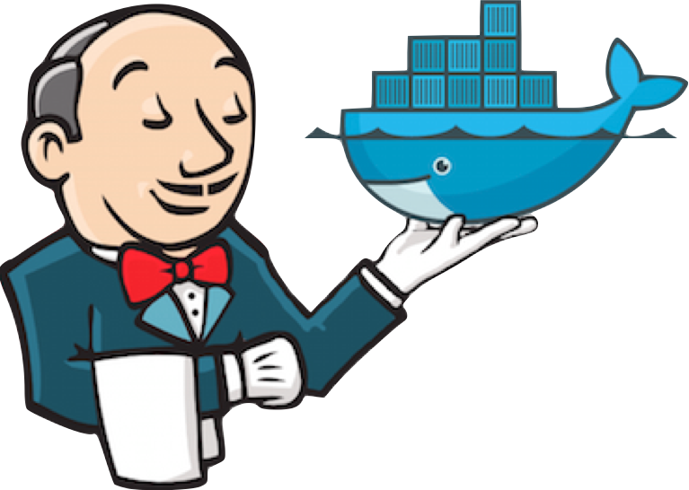
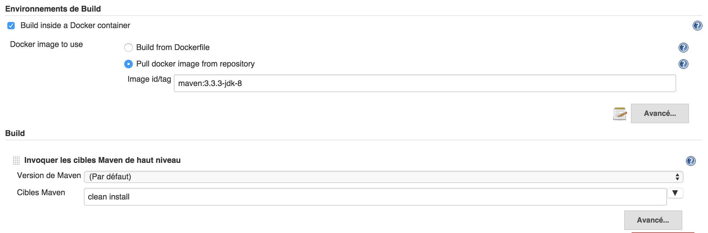
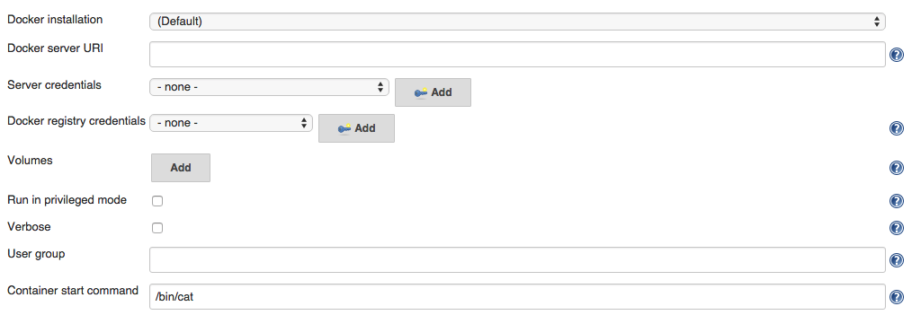
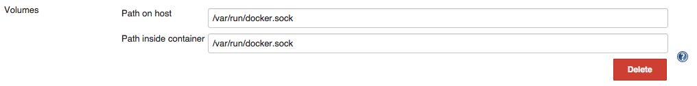

# Docker Custom Build Environment Plugin for Jenkins

[](https://plugins.jenkins.io/docker-custom-build-environment/)
[](https://plugins.jenkins.io/docker-custom-build-environment/)

This plugin allows the definition of a build environment for a job using a Docker container.



## Introduction

A major requirements for a Jenkins-based Continuous Integration/Delivery
setup are:

- Ensure the build/test environment is exactly reproducible from a pre-defined setup.
- Ensure the build/test environment is well isolated from other builds executed on the same infrastructure.

Docker is a great way to bootstrap reproducible and isolated environments. Compared to a virtual machine, it's faster to launch and lighter to use. Another benefit is the Docker image can be defined both as a binary image pulled from repository, or as a plain text Dockerfile you can store in SCM along side the project source code, so that the source and environment are always in sync and recorded.

CloudBees Docker Custom Build Environment Plugin has been designed to make Docker Images / [Dockerfile](https://docs.docker.com/reference/builder/) a first class citizen in a continuous delivery setup, which allows the simplest way for a development team to manage the exact bits of the build environment whilst the infrastructure team only has to focus on available resources hosting arbitrary docker containers.

## User Guide

CloudBees Docker Custom Build Environment Plugin can be used from any job type, it appears in the "build environment" section and let you configure your build to run inside a Docker container.

You can :

- Select the Docker image to run the build as a **Docker image** to be pulled. This is comparable to the [docker-plugin](https://plugins.jenkins.io/docker-plugin/) approach to offer docker agents within Jenkins, but without any prerequisites on the Docker image nor need for Administrator privileges to configure the adequate agent template.

- Configure the plugin to build a container image **from a  Dockerfile** stored in project repository. With this setup, you get both the project source code and build environment defined in SCM. This is my preferred way to use this plugin.

SCM checkout will run within a classic Jenkins agent execution context - this is required to access the project Dockerfile then build and run the required container.

### Using Docker image

CloudBees Docker Custom Build Environment let you use arbitrary docker image to host the build. You can use such an image you build on your own (or using [CloudBees Docker Build and Publish](https://plugins.jenkins.io/docker-build-publish/) plugin) to define the set of prerequisites for your project and share with the development team, as well as reuse for your CI job. In
following sample, maven+jdk8 image available on DockerHub is used as a reference environment to host a maven build.



### Using a Dockerfile

You also can have a Dockerfile and context stored in your project SCM aside your source code, so team can maintain them together and/or use distinct Dockerfile per branch. If you use this option, CloudBees Docker Custom Build Environment will build the image on first build and then will compare your Dockerfile with the one used on previous build to check a rebuild is necessary.

As for Docker images, there's no requirement on the Dockerfile you're using.

## Advanced options

CloudBees Docker Custom Build Environment integrates with [Docker-commons](https://plugins.jenkins.io/docker-commons/) plugin so you can define the docker cli executable to be used to interact with Docker daemon, as well as select TLS credentials to be used to access a secured infrastructure (which is highly recommended)



> **Verbose** option allows to dump on build log the docker-cli command output. This is mostly designed for diagnostic purpose.

### Volumes

The build container is ran with Project workspace entire Jenkins Home mounted inside container, so your build tools can access the SCM working copy and produce binaries / reports. The temporary directory is also mounted as many plugin do rely on this one to pass commands or credentials files that get deleted on build completion.

You can configure extra directories to be mounted into container, a common use-case is to have the dependency manager local cache storing artifacts on executor host so you don't have to download them again and again for every build. 

### User Group

Plugin design do require the user running build commands to be the same as jenkins agent user, so jenkins can manage files created in Workspace without hitting permission issues. As Docker does not (yet) support user namespace, there's no way to use a distinct user without breaking workspace at some point. For some use cases this is a major issue, as the container is designed with some specific permission set to a user.

As a workaround, you can define the group for the user running commands during the build, and setup this group inside your container with adequate permissions.

### Docker in Docker

Sometime your build will require to create some other Docker containers, for sample to bootstrap a test database used by your integration tests.

Docker allows to host a docker daemon inside a docker container, known as "[Docker in Docker](https://github.com/jpetazzo/dind)". You can use `jpetazzo/dind` docker image (or a derived one) but will need to run container with escalated permission ("privileged mode") which you should consider twice as this has some significant security impacts. This also require some tweak in plugin configuration, so the command used to bootstrap the container do setup the docker daemon :

- run in privileged mode
- set startup command to run wrapdocker 
- configure plugin to run within the 'docker' group so you can access the docker socket.


An alternative to Docker in Docker is to let the docker container hosting the build communicate with the host docker daemon so it can start other container, aside the build container. To achieve this, you can configure your Build container to run with docker daemon unix socket mounted, so you can run docker commands within your build. Use the "volumes" advanced option for this purpose



Please note : this is your responsibility to get the docker cli executable in your container. Simplest option is to include those lines in your Dockerfile :

``` dockerfile
RUN wget https://get.docker.io/builds/Linux/x86_64/docker-latest -O /bin/docker
RUN chmod +x /bin/docker
```

you would from command line. If the container you're starting need to volumes used by your build container. Let's say for sample you have a docker image for application server which expect as launch parameter the path to your application WAR package. You can then run :

``` sh
docker run --volumes-form $BUILD_CONTAINER_ID application_server_docker_image $WORKSPACE/dist/myapp.war
```

### Environment variables

plugin do expose BUILD\_CONTAINER\_ID variable during the build so you can make reference to the container hosting the build when needed.

## Prerequisites

The agent executor(s) running jobs need to have docker installed and the daemon running. We suggest you use a "docker" label for such agents, so you benefit from Jenkins agent management and cloud capabilities.

## History

This plugin was already known as "Oki-Docki" but this name made it difficult for people to discover it within update center :-\\

It has been created as part of DockerCon hackathon by Nicolas and Yoann. We ended as \#2 team on the challenge :D

## Developer tips

If you want to run this plugin on Windows / OSX for development, please note the plugin will bind mount the temporary directory inside container, so you probably will have to run jenkins JVP with `-Djava.io.tmpDir=$HOME/tmp` as only the users home directory is accessible when using boot2docker.

## Future plans

- support docker-compose

## Versions

[Changelog](./CHANGELOG.md)

## Notes

### Implementation details

The docker container is ran after SCM has been checked-out into a agent workspace, then all later build commands are executed within the container thanks to [docker exec](https://blog.docker.com/2014/10/docker-1-3-signed-images-process-injection-security-options-mac-shared-directories/) introduced in Docker 1.3. When configured to build container from a Dockerfile, the plugin computes the Dockerfile checksum and uses it as container ID, so it can detect if the image exists on a agent and so only build it the first time it is requested.

### Comparison

Compared to [docker plugin](https://plugins.jenkins.io/docker-plugin/),

- This plugin can use arbitrary docker images, there is NO prerequisite to get a specific user set, ssh daemon, or even JDK available in docker container you use for the build - no need for CI-specific docker image, can use the exact same docker image you use on developer workstation to run/test your project.

- Changes to the project that require new tools / version upgrades can be reflected in the Dockerfile within an atomic commit. No need to reconfigure the job or wait for the adequate agent to be setup. You can also use a distinct Dockerfile per project branch.

- The user doesn't need Administrator privileges to setup a docker-agent template, you just need to commit a Dockerfile to your source repository.

- Docker-plugin abuses the Jenkins Cloud API. _i.e. you have to define a fixed IP address and can't benefit from a Cloud agent provider, or a pool of generic agents._ CloudBees Docker Custom Build Environment only relies on agents which have docker installed, and Jenkins will provision/pick-up available ones using all available agents provider plugins.
